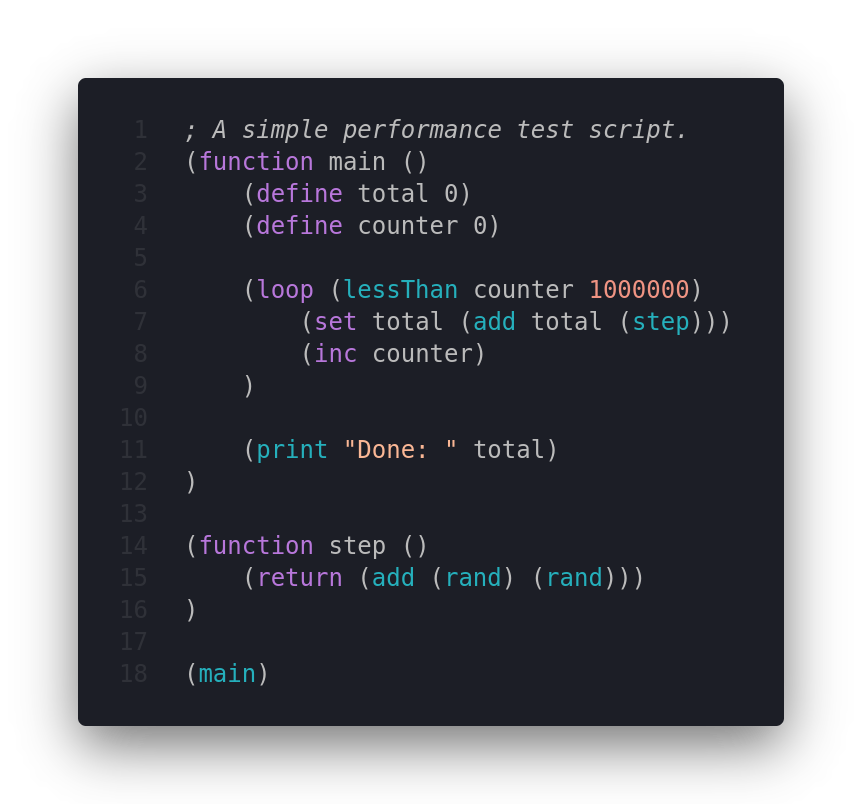

# Lysithea Language Support

Adds basic Lysithea script support for VSCode. Check out the [Lysithea Github](https://github.com/astrellon/lysithea-vm) for more information about the scripting language.

## Features

Highlights function calls, keywords, numbers, labels and comments.

## Requirements

None at the moment.

## Extension Settings

None at the moment.

## Known Issues

Does not make use of a language server, so it cannot highlight builtin functions or function calls in general.

## Release Notes

Basic handling of language, highlights value types and keywords.

### 1.0.0

Initial release of Lysithea language support.
